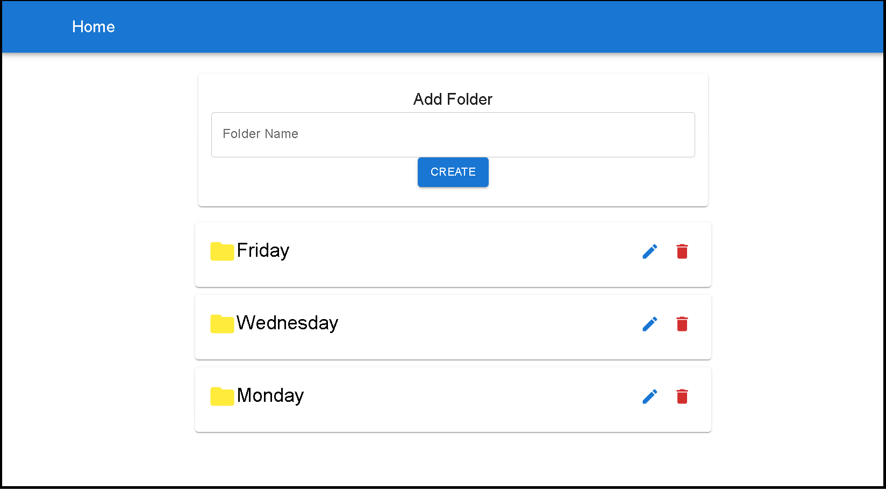
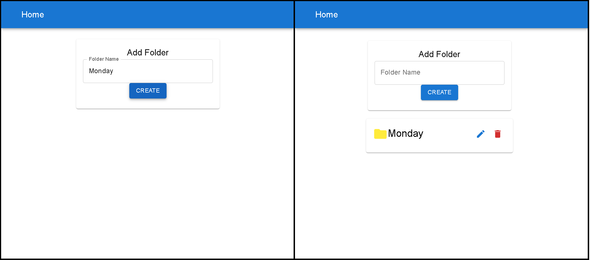
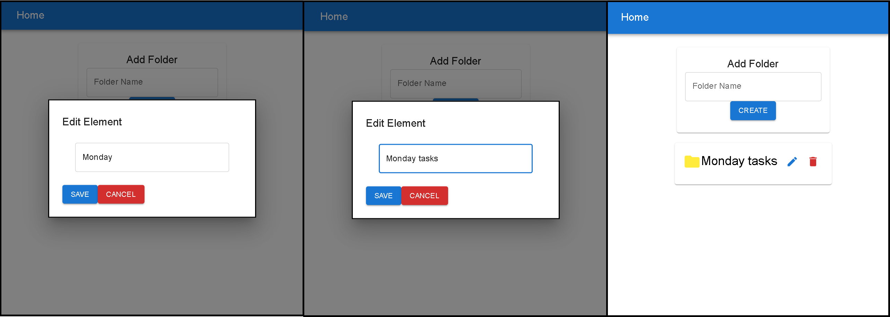
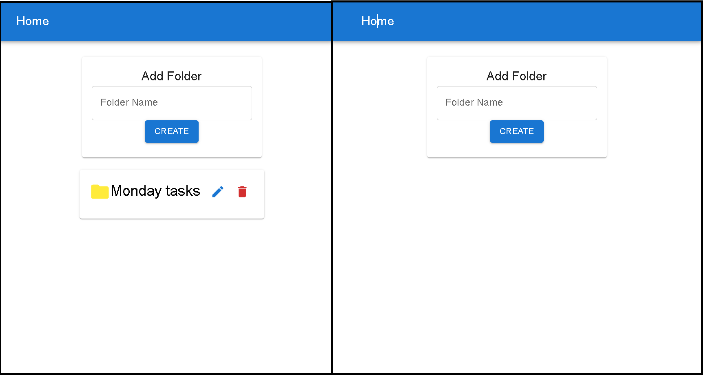
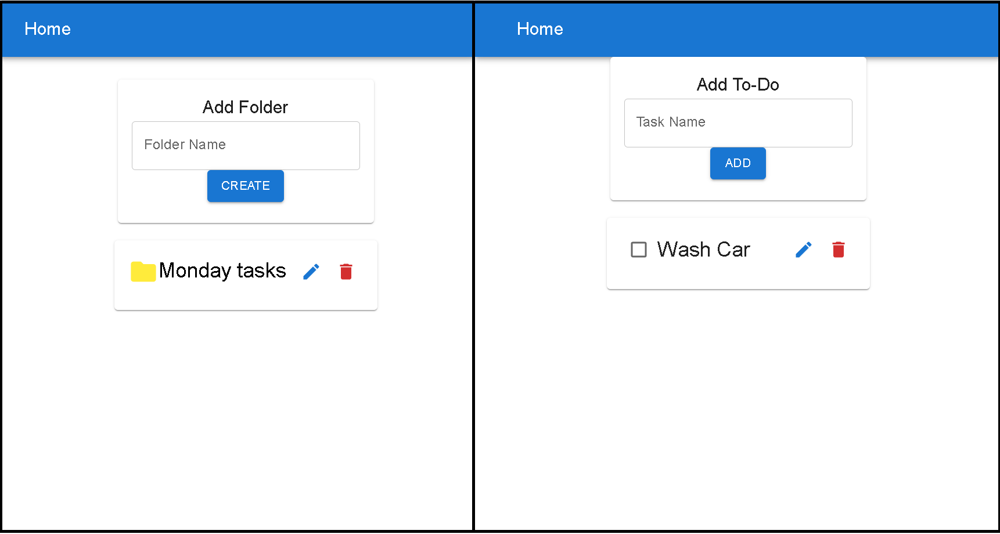
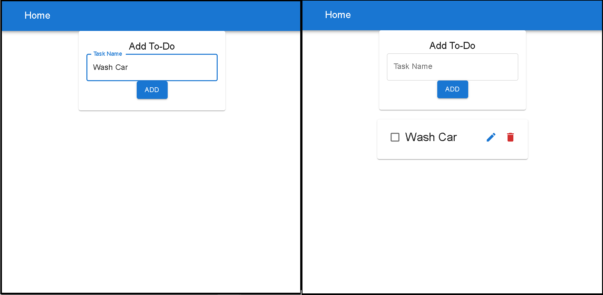
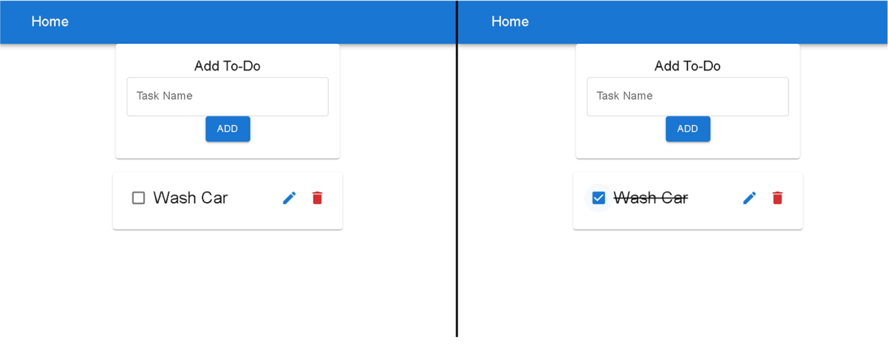
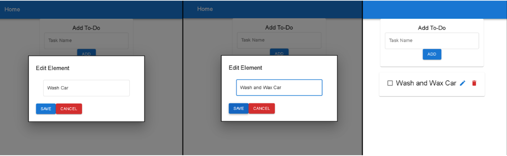
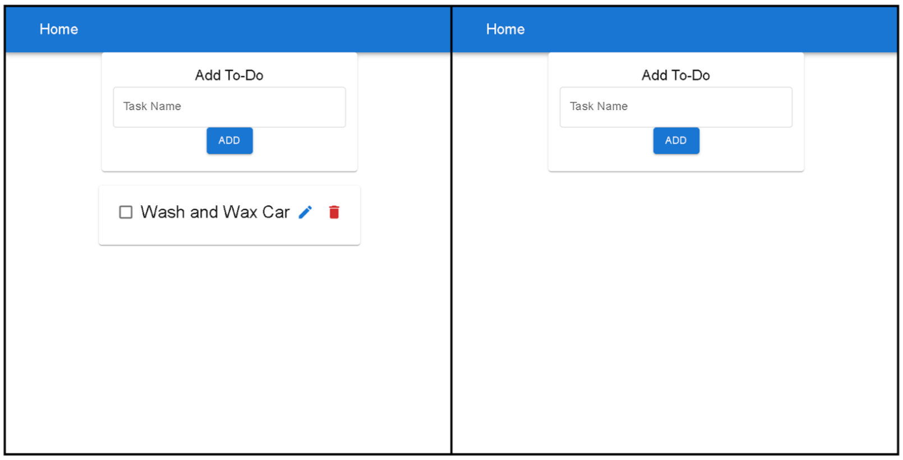

# To-Do App

## About <a name = "about"></a>

This is a fullstack To-Do List web application. Here you can create multiple folders where you can store and keep track of different tasks that need to be done. Once the tasks are finished, you can check them as completed. You can also edit and/or delete tasks and folders. If you choose to delete the folder, the tasks stored in that folder will also be deleted.

This application was created using Django for the backend and React for the frontend.

## Getting Started <a name = "getting_started"></a>

These instructions will get you a copy of the project up and running on your local machine for development and testing purposes.

### **Prerequisites**

This app was verified with Python v3.9, pip v20.2.3, Django v3.2.9, djangoframework v3.12.4, django-cors-headers v3.10.0, Node v14.17.6, npmv6.14.15, React Js v17.0.2, axios v0.24.0 and Material UI v5.2.2

**Backend:**

- Install Python Version 3.5 or lated
- Install Django Version 3.2.X or later
- Install Django Rest Framework Version 3.12.X later
- SQLite3 3.9.0 upward (comes included with the installation of Django)

**Frontend:**

- Install Node Js Version 14.17.6 or later
- React Js Version 17 or later
- Material UI Version 5.2.2
- Axios Version 0.24 or later

### **Installing**

#### Cloning the repo from github:

Choose a location on your machine (Windows/ Mac), where you want to save/clone the project and then execute the following command:

```
$ git clone https://github.com/ajdm31/fullstack-to-do-app.git
```

Then cd to the newly cloned folder:

```
$ cd fullstack-to-do-app
```

Once inside the folder, you can execute the bash script to run the app in production mode using the following command:

```
$ sh run.sh
```

You also have the opportunity to run the app in development mode with the following steps:

### **Backend (Python/Django):**

- Creating and activating the Virtual Environment

Install virtual environment and activate it.

```
$ python3 -m venv venv

# Activate on MACOS/Linux
$ source venv/bin/activate

# Activate on Windows
venv\Scripts\activate
```

- cd to the 'app' folder and Install the libraries in “requirments.txt” using pip install -r:

```
$ cd app
$ pip install -r requirements.txt
```

- Run the django server using the following command:

```
$ python3 manage.py runserver
```

At this point the server will start running locally by default at port :8000/

### **Frontend (React):**

Open another terminal and from the root folder:

- cd to the 'app/frontend' folder and Install the npm dependencies with the following command:

```
npm install
```

- Run the react development server using the following command:

```
npm start
```

At this point the server will start running locally by default at port :3000/

## Usage <a name = "usage"></a>

### Home Page

This is the main/home page and the first display the user will be greeted with when opening the web application. Here are all the different folders that have been created, along with a navigation bar located on the top with a “Home” option located to the left.



To create a new folder, the user must type the name of the folder in the input field identified as “folder name” and then press the “Create” button. If no name is specified, and the user presses the “Create” button, no folder will be created.



Once the new folder has been created, it will appear underneath the input field, as an element in a list. Here the user can see all the options available for this newly created folder. These options include a folder icon to the left, and an edit icon and a delete icon to the right.

When the user presses the edit icon, a pop-up window will appear where you can change the name of this particular folder.



If the user presses the delete icon, the folder will be deleted.



When the user presses directly on the name of the folder or on the yellow folder icon to the left, the content inside this folder will be displayed, that is to say, the To-Do tasks that have been created inside this folder.



### Inside Folder/To-Do view

To create a new To-Do task, the user must type the task in the input field identified as “task name” and then press the “Add” button. If no name is specified, and the user presses the “Add” button, no task will be created.



Once the new task has been created, it will appear underneath the input field, as an element in a list. Here the user can see all the options available for this newly created task. There is a checkbox to the left of the name, where you can indicate that the task has been completed or not. If the checkbox is clicked, a straight line will appear through the task, indicating that it has been completed.



There is also an edit icon and a delete icon to the right. When the user presses the edit icon, a pop-up window will appear where you can change the content of the task.



If you user presses the delete icon, that task will be deleted.



At any time, the user can press the “Home” option located to the left of the top navigation bar, and the main folder menu will be displayed.

## Resorurces <a name = "resources"></a>

- Django official webpage: https://www.djangoproject.com/
- Django Rest Framework :https://www.django-rest-framework.org/
- React official webpage: https://reactjs.org/
- Axios documentation: https://www.npmjs.com/package/axios
- Material UI official webpage: https://mui.com/
